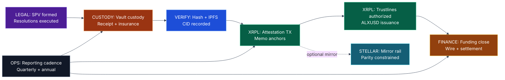
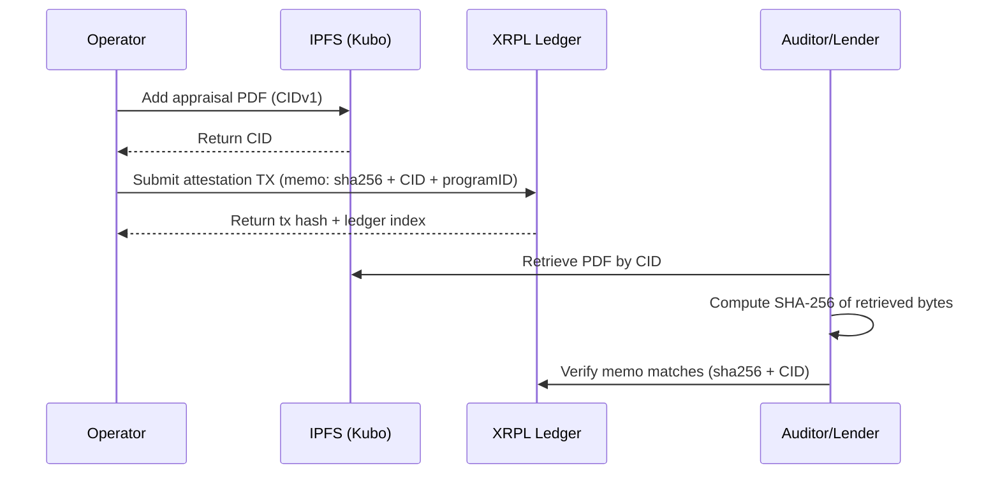
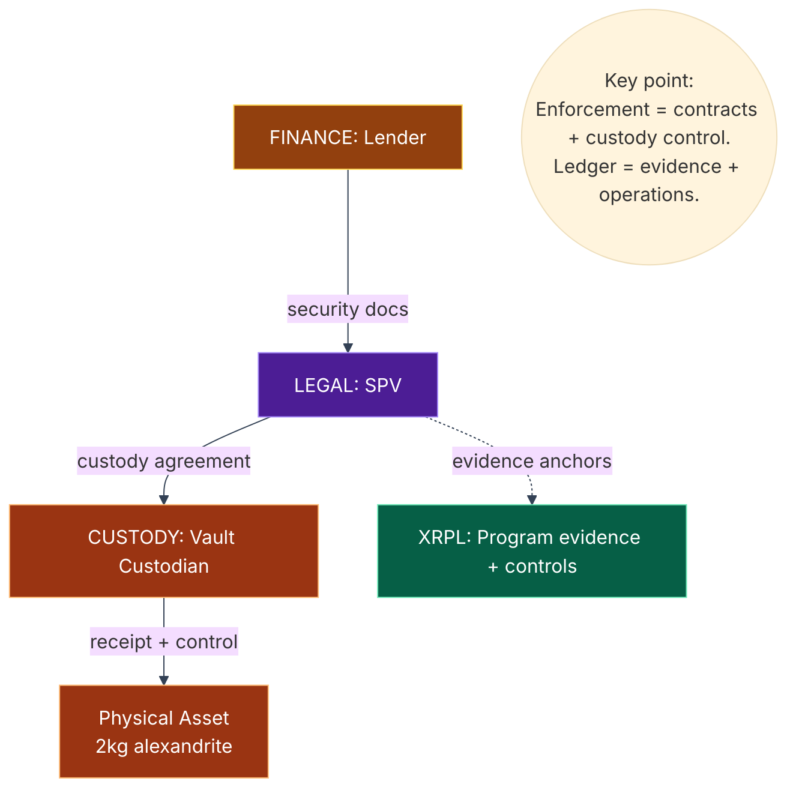
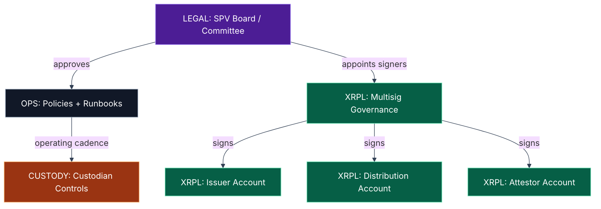
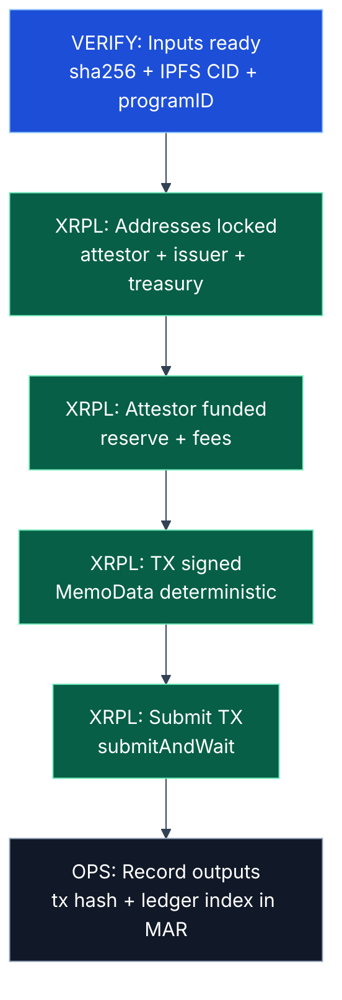
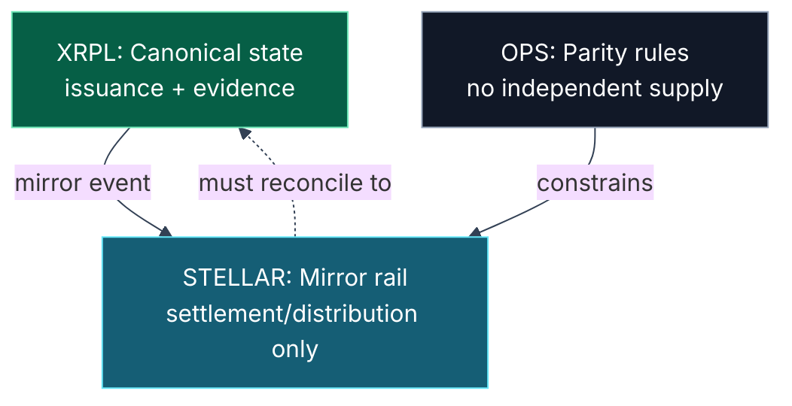

# COLOR-CODED DIAGRAM PACK (SR LEVEL)

This pack is designed to be readable in a single sitting by a credit committee.
Color system: [STYLE-COLOR-SYSTEM.md](../STYLE-COLOR-SYSTEM.md)

---

## 1) End-to-End Execution Flow (Color-Coded)



---

## 2) Key Ceremony: Evidence Anchoring (Immutable Proof Path)



---

## 3) Credit Enforcement Reality (What Controls the Asset)



---

## 4) Governance and Key Control Tree (How Actions Are Authorized)



---

## 5) XRPL Attestation Ceremony Tree (Irreversible Sequence)



---

## 6) IOU Lifecycle (Permissioned Controls)

```mermaid
%%{init: {"theme":"base","themeVariables":{
  "fontFamily":"Inter, Segoe UI, Arial",
  "lineColor":"#334155"
}}}%%
flowchart LR
  KYC[OPS: KYC/AML + Agreement signed]:::ops --> TL[XRPL: Trustline created]:::xrpl
  TL --> AUTH[XRPL: Trustline authorized\nRequireAuth]:::xrpl
  AUTH --> ISSUE[XRPL: Issue ALXUSD]:::xrpl
  ISSUE --> HOLD[XRPL: Hold / Transfer (permissioned)]:::xrpl
  HOLD --> REDEEM[LEGAL: Redemption request\nper policy]:::legal
  REDEEM --> BURN[XRPL: Return + retire IOU]:::xrpl

  classDef legal fill:#4c1d95,stroke:#a78bfa,color:#fff,stroke-width:1px;
  classDef xrpl fill:#065f46,stroke:#6ee7b7,color:#fff,stroke-width:1px;
  classDef ops fill:#111827,stroke:#94a3b8,color:#fff,stroke-width:1px;
```

---

## 7) Stellar Mirror Guardrails (Parity, Not Canonical)


