# COLOR-CODED DIAGRAM PACK (SR LEVEL)

This pack is designed to be readable in a single sitting by a credit committee.

---

## 1) End-to-End Execution Flow (Color-Coded)

---

## 2) Key Ceremony: Evidence Anchoring (What makes it immutable)

---

## 3) Credit Enforcement Reality (What controls the asset)

```mermaid
flowchart TB
  L[🟡 Lender]:::fin -->|security docs| S[🟣 SPV]:::legal
  S -->|custody agreement| V[🟠 Vault Custodian]:::cust
  V -->|receipt + control| A[Physical Asset\n2kg alexandrite]:::cust
  S -. evidence anchors .-> X[🟢 XRPL program]:::xrpl

  note((Key point: enforcement is\ncontract + custody control.\nXRPL is evidence + operations.))

  classDef legal fill:#4c1d95,stroke:#a78bfa,color:#fff;
  classDef cust fill:#9a3412,stroke:#fdba74,color:#fff;
  classDef xrpl fill:#065f46,stroke:#6ee7b7,color:#fff;
  classDef fin fill:#92400e,stroke:#fcd34d,color:#fff;
```

