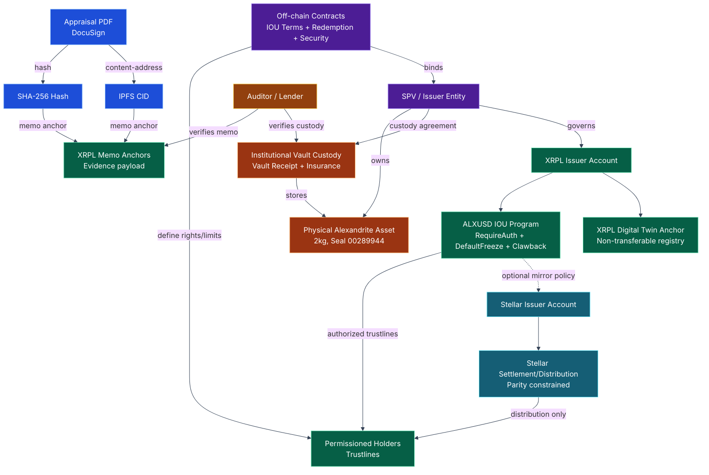

# SYSTEM ARCHITECTURE (XRPL CANONICAL + STELLAR MIRROR)

This diagram is color-coded per [STYLE-COLOR-SYSTEM.md](../STYLE-COLOR-SYSTEM.md).

**Notes**
- XRPL is canonical for evidence anchoring and IOU controls.
- Stellar is optional and must not become an independent truth source.
