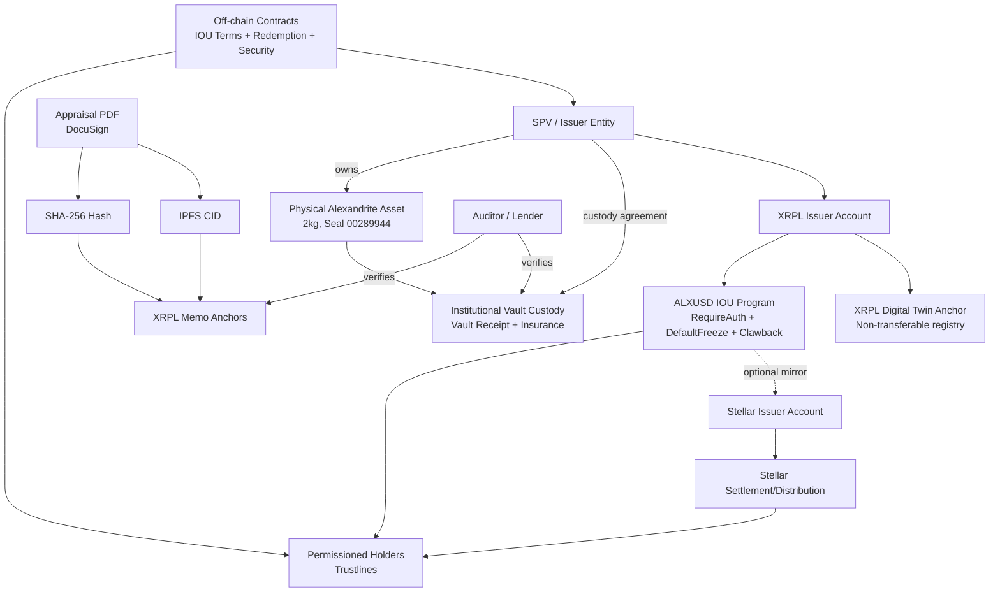

# SYSTEM ARCHITECTURE (XRPL CANONICAL + STELLAR MIRROR)

**Notes:**
- XRPL is canonical for issuance evidence and memo anchoring.
- Stellar is optional and must not become an independent truth source.
