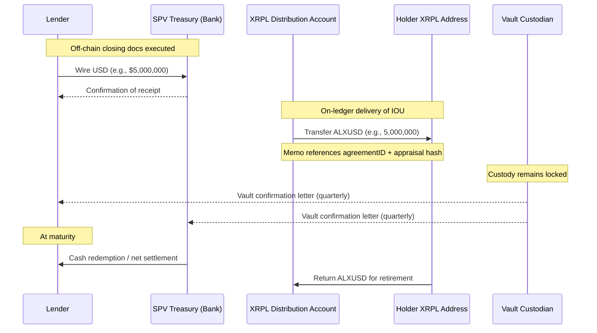

# FUND FLOW (FIRST TRANCHE)

```mermaid
sequenceDiagram
  participant L as Lender
  participant S as SPV Treasury (Bank)
  participant X as XRPL Distribution Account
  participant H as Holder XRPL Address
  participant V as Vault Custodian

  Note over L,S: Off-chain closing docs executed
  L->>S: Wire USD (e.g., $5,000,000)
  S-->>L: Confirmation of receipt

  Note over X,H: On-ledger delivery of IOU
  X->>H: Transfer ALXUSD (e.g., 5,000,000)
  Note over X,H: Memo references agreementID + appraisal hash

  Note over V: Custody remains locked
  V-->>L: Vault confirmation letter (quarterly)
  V-->>S: Vault confirmation letter (quarterly)

  Note over L: At maturity
  S->>L: Cash redemption / net settlement
  H->>X: Return ALXUSD for retirement
```

**Notes:**
- The gemstone does not move.
- Enforcement lives in custody control + contracts; XRPL provides verification and operational tracking.
