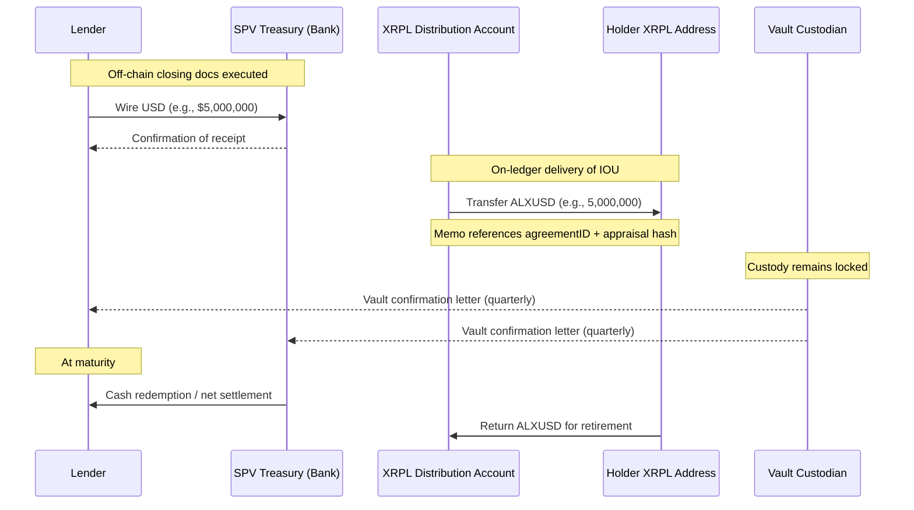

# FUND FLOW (FIRST TRANCHE)

This diagram is color-coded per [STYLE-COLOR-SYSTEM.md](../STYLE-COLOR-SYSTEM.md).

## 1) Committee View (Control + Settlement)

```mermaid
%%{init: {"theme":"base","themeVariables":{
  "fontFamily":"Inter, Segoe UI, Arial",
  "lineColor":"#334155"
}}}%%
flowchart LR
  L[Finance Provider / Lender]:::fin -->|credit docs + security| SPV[SPV Treasury (Bank)]:::legal
  SPV -->|custody control agreement| V[Vault Custodian]:::cust
  V -->|receipt + periodic confirmations| A[Physical Asset\n2kg alexandrite]:::cust

  SPV -->|program governance| X[XRPL Program Accounts]:::xrpl
  X -->|authorize trustline| H[Permissioned Holder]:::xrpl
  X -->|deliver ALXUSD IOU| H

  SPV -. evidence disclosure .-> E[Verification Evidence\nSHA-256 + IPFS CID + XRPL memo]:::verify
  X -->|attestation memo| E

  classDef legal fill:#4c1d95,stroke:#a78bfa,color:#fff,stroke-width:1px;
  classDef cust fill:#9a3412,stroke:#fdba74,color:#fff,stroke-width:1px;
  classDef verify fill:#1d4ed8,stroke:#93c5fd,color:#fff,stroke-width:1px;
  classDef xrpl fill:#065f46,stroke:#6ee7b7,color:#fff,stroke-width:1px;
  classDef fin fill:#92400e,stroke:#fcd34d,color:#fff,stroke-width:1px;
```

## 2) Operational Sequence (First Tranche)



**Notes**
- The gemstone does not move.
- Enforcement lives in custody control + contracts; XRPL provides verification and operational tracking.
