# FLOW TREES (SR LEVEL)

These are hierarchical flow trees intended for quick review by a credit committee or auditor.
Color system: [STYLE-COLOR-SYSTEM.md](../STYLE-COLOR-SYSTEM.md)

---

## 1) Data Room / Artifact Tree (What exists, where)

```mermaid
%%{init: {"theme":"base","themeVariables":{
  "fontFamily":"Inter, Segoe UI, Arial",
  "lineColor":"#334155"
}}}%%
flowchart TB
  ROOT[OPS: Executive Portal]:::ops

  ROOT --> LEG[LEGAL: /legal]:::legal
  ROOT --> CUS[CUSTODY: /custody]:::cust
  ROOT --> VER[VERIFY: /asset]:::verify
  ROOT --> X[XRPL: /xrpl + /onchain]:::xrpl
  ROOT --> F[FINANCE: /finance]:::fin
  ROOT --> O[OPS: /ops]:::ops
  ROOT --> D[OPS: /diagrams]:::ops

  LEG --> LEG1[SPV + board docs]:::legal
  LEG --> LEG2[IOU terms + redemption]:::legal

  CUS --> CUS1[Vault selection + RFP]:::cust
  CUS --> CUS2[Chain of custody + insurance]:::cust

  VER --> VER1[SHA-256 record]:::verify
  VER --> VER2[IPFS CID record]:::verify
  VER --> VER3[Master Asset Record]:::verify

  X --> X1[Issuer + currency definition]:::xrpl
  X --> X2[Trustline + issuance flows]:::xrpl
  X --> X3[Freeze/clawback policy]:::xrpl
  X --> X4[Attestation TX templates]:::xrpl

  F --> F1[Term sheet + LTV model]:::fin
  F --> F2[Structure + use cases]:::fin

  classDef legal fill:#4c1d95,stroke:#a78bfa,color:#fff,stroke-width:1px;
  classDef cust fill:#9a3412,stroke:#fdba74,color:#fff,stroke-width:1px;
  classDef verify fill:#1d4ed8,stroke:#93c5fd,color:#fff,stroke-width:1px;
  classDef xrpl fill:#065f46,stroke:#6ee7b7,color:#fff,stroke-width:1px;
  classDef fin fill:#92400e,stroke:#fcd34d,color:#fff,stroke-width:1px;
  classDef ops fill:#111827,stroke:#94a3b8,color:#fff,stroke-width:1px;
```



---

## 2) Execution WBS Tree (What must happen, in order)

```mermaid
%%{init: {"theme":"base","themeVariables":{
  "fontFamily":"Inter, Segoe UI, Arial",
  "lineColor":"#334155"
}}}%%
flowchart TB
  W0[OPS: Program Launch]:::ops

  W0 --> W1[LEGAL: SPV + authority]:::legal
  W0 --> W2[CUSTODY: vault + insurance]:::cust
  W0 --> W3[VERIFY: hash + IPFS]:::verify
  W0 --> W4[XRPL: canonical attestation + controls]:::xrpl
  W0 --> W5[FINANCE: facility close]:::fin
  W0 --> W6[OPS: cadence + reporting]:::ops

  W1 --> W1a[board resolutions executed]:::legal
  W1 --> W1b[asset contribution agreement]:::legal
  W1 --> W1c[no-lien confirmations]:::legal

  W2 --> W2a[vault receipt issued]:::cust
  W2 --> W2b[insurance binder active]:::cust
  W2 --> W2c[control agreement for lender (if any)]:::cust

  W3 --> W3a[sha256 computed + recorded]:::verify
  W3 --> W3b[IPFS CID minted + pinned]:::verify

  W4 --> W4a[addresses locked + funded]:::xrpl
  W4 --> W4b[attestation tx submitted]:::xrpl
  W4 --> W4c[trustlines authorized]:::xrpl
  W4 --> W4d[issuance + redemption ops]:::xrpl

  W5 --> W5a[term sheet signed]:::fin
  W5 --> W5b[conditions precedent met]:::fin
  W5 --> W5c[wire + settlement completed]:::fin

  classDef legal fill:#4c1d95,stroke:#a78bfa,color:#fff,stroke-width:1px;
  classDef cust fill:#9a3412,stroke:#fdba74,color:#fff,stroke-width:1px;
  classDef verify fill:#1d4ed8,stroke:#93c5fd,color:#fff,stroke-width:1px;
  classDef xrpl fill:#065f46,stroke:#6ee7b7,color:#fff,stroke-width:1px;
  classDef fin fill:#92400e,stroke:#fcd34d,color:#fff,stroke-width:1px;
  classDef ops fill:#111827,stroke:#94a3b8,color:#fff,stroke-width:1px;
```
